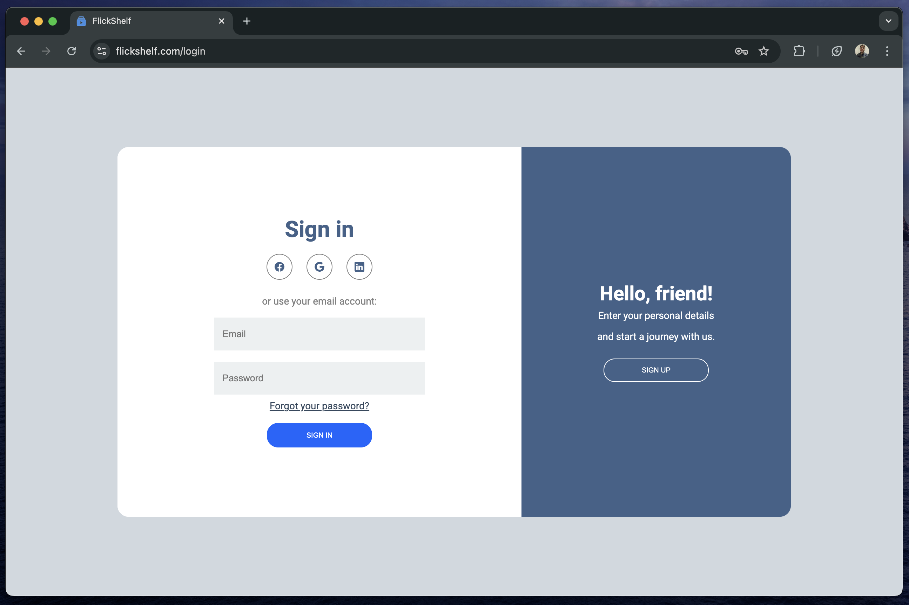
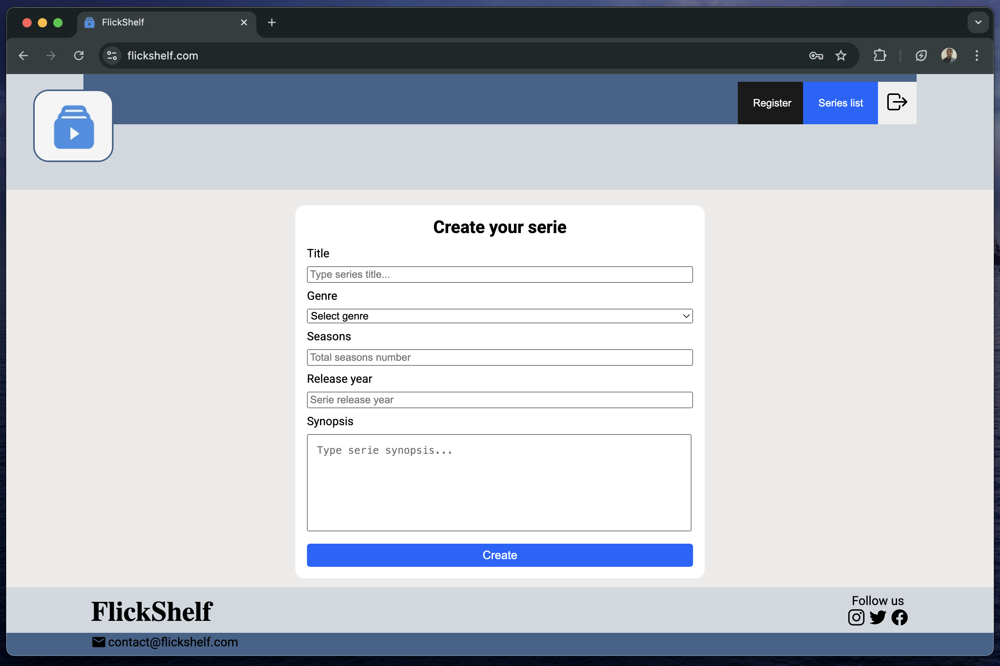

# FlickShelf

# Flickshelf UI V2 - React

### Screenshots:

### Description:
App for series watching management, where will be possible to create series, informing title, genre, number os seasons, release year, and other informations.

### Project features: 🚀
- Sign up
- Login
- Serie creation;
- Serie update;
- Serie deletion;
- Series list;
- Integration with TMDB API for series info and covers.

### Initial series properties:
- Title;
- Genre;
- Number of seasons;
- Release year;
- Synopsis.

### Utilized techs:
- ReactJS;
- Node.js;
- PostgreSQL;
- Docker;
- HTML;
- CSS;
- JavaScript;
- Axios.

### Project management on Trello: 
https://trello.com/b/GVvbCHN5/flickshelf

### Github project repo:
https://github.com/flickshelf
